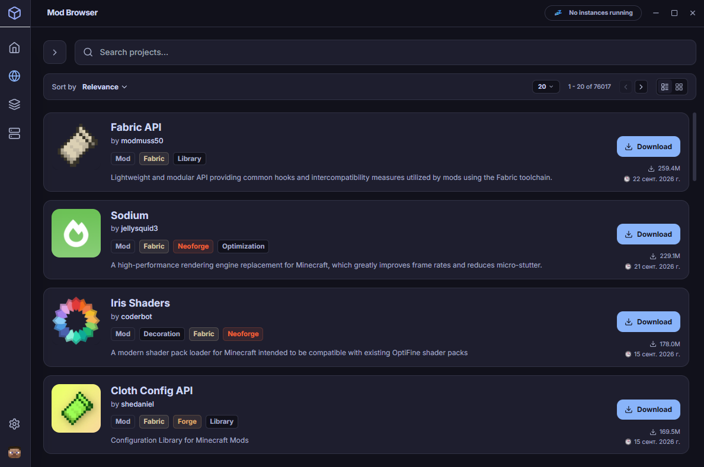
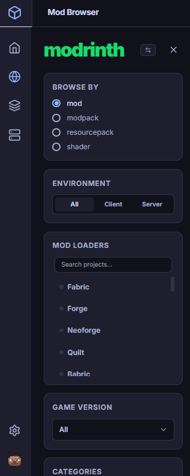
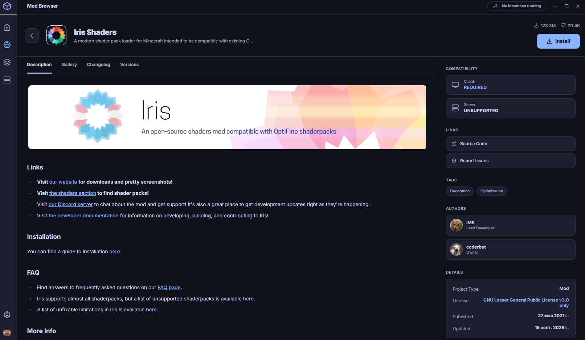
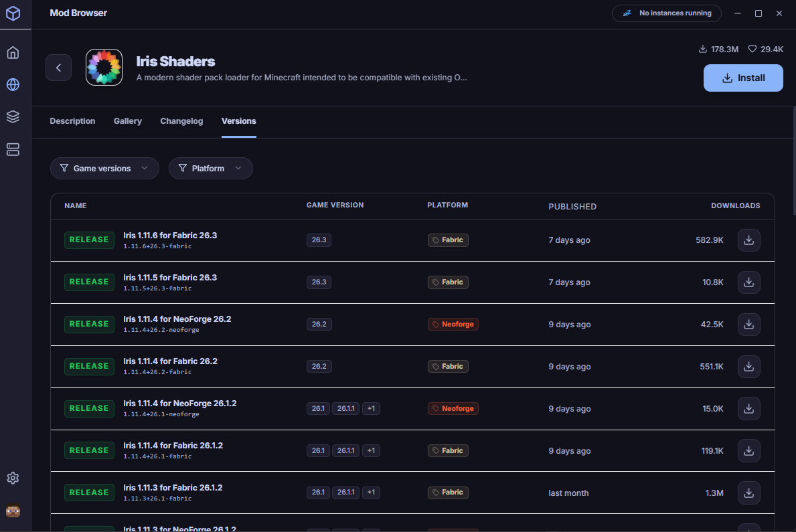
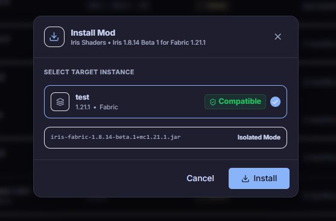
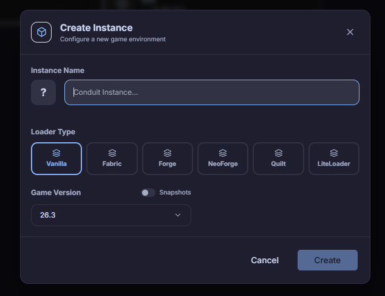
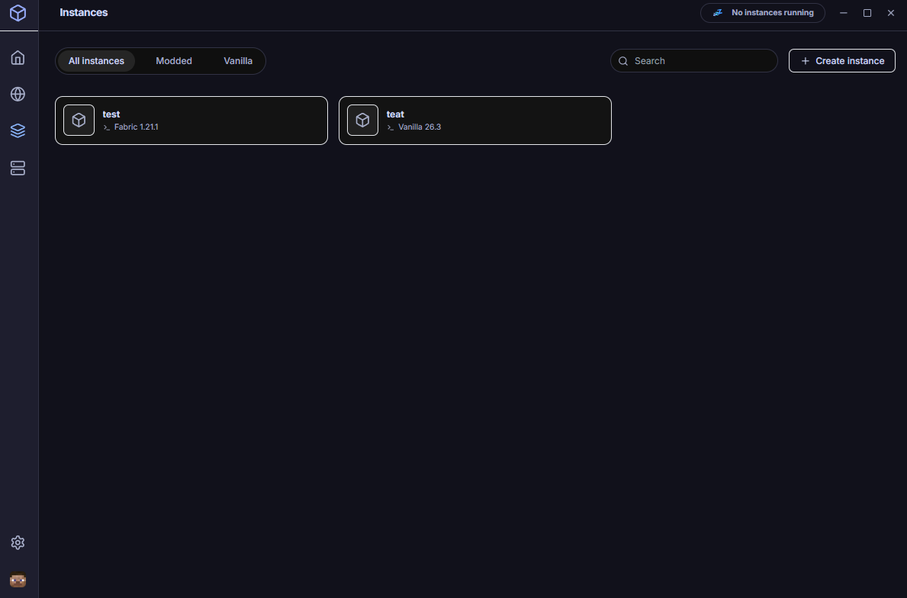
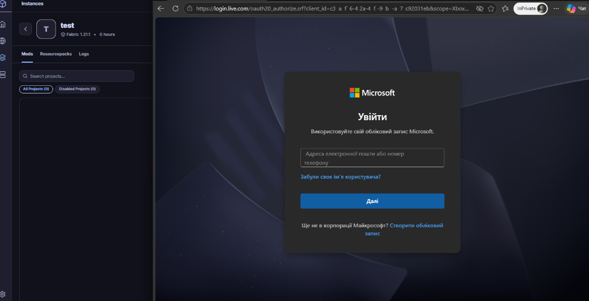
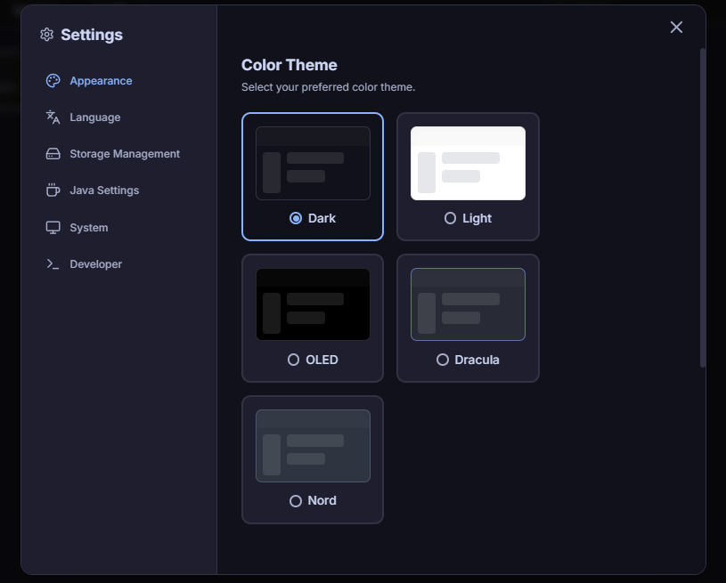

  <h1>Conduit</h1>
  
<b>A modern, high-performance Minecraft client manager and server orchestration platform built with .NET 8 and React.</b>

  
  
  
  
  

 

*Note: The interface and visuals are currently Work in Progress (WIP) and subject to further enhancement.*

## 📌 Repository Status: Partial Public Preview

Conduit is currently in an active pre-release development phase. To protect proprietary API integration techniques, rate-limiting algorithms, and server-side infrastructure during the stabilization period, the backend `Infrastructure` and `ServerAgent.Daemon` modules are temporarily maintained in a private staging repository. 

However, the complete **Frontend Architecture (React/FSD)** and **Core Domain/Application contracts (C#)** are provided in this repository to demonstrate the project's active codebase, architectural integrity, and integration readiness. The full source code will be merged upon the public v1.0 release.

---

## 🧭 The Conduit Philosophy

Historically, the Minecraft ecosystem has been divided: players use one set of tools to manage their local game instances, while administrators use entirely different platforms to host and monitor servers. Conduit bridges this gap.

Conduit is a unified platform designed to act as a bridge between local gameplay and remote server administration. It allows a user to assemble a modpack locally, test it, and seamlessly deploy the server-side equivalent to a remote VPS from the exact same interface.

**Core Principles:**
*   **Performance by Design:** Built on Photino.NET. By replacing the traditional Electron (Chromium) wrapper with a native OS web engine, Conduit maintains a sub-60MB memory footprint while idle.
*   **Strict Security:** No passwords or sensitive tokens are stored in plain text. Authentication relies exclusively on the official Microsoft OAuth2 flow (MSAL) and OS-level credential encryption.
*   **Total Ecosystem Support:** Native support for Vanilla, Fabric, Forge, NeoForge, Quilt, and LiteLoader environments.

---

## ⚙️ Core Architecture & Innovations

Conduit goes beyond simple file downloading. It implements several advanced systems to ensure stability, optimize disk space, and protect user environments.

### 1. Hierarchical Storage & Mod Deduplication
Users can choose how mods are stored on a per-instance basis:
*   **GlobalCache Mode (Hardlinks):** Mods are downloaded once to a global repository. Instances create OS-level Hardlinks to these files. If a user has 5 instances utilizing the same 15MB mod, it occupies physical disk space only once. If hardlinks are not supported (e.g., crossing different physical drives), the system gracefully falls back to standard file copying.
*   **Isolated Mode:** All files are copied directly into the instance folder, ensuring 100% portability (ideal for moving modpacks via USB drives).

### 2. Smart Dependency Graph (DAG) & Reference Counting
When downloading content from platforms like Modrinth, Conduit does not just fetch `.jar` files; it builds a dependency tree:
*   **Reference Counting:** If Mod A and Mod B both require a Library C, Library C's `required_by` array tracks both.
*   **Advisory Garbage Collection:** If a user deletes Mod A and Mod B, Library C becomes an "orphan". Instead of deleting it silently and risking instance corruption, Conduit prompts the user with an advisory warning to clean up unused libraries.
*   **Pre-flight Compatibility Checks:** Before any files are downloaded, the system evaluates the proposed state. If a required dependency conflicts with an already installed mod, the installation is blocked, and the user is provided with a clear resolution path.

### 3. API Security & Tiered Credential Management
As an open-source project, Conduit employs a tiered security model to prevent API key leakage while remaining fully forkable:
*   **Public Identifiers (Microsoft OAuth):** Handled securely via MSAL with build-time injection. 
*   **Private APIs (CurseForge / LLMs):** The desktop client **never** holds private API keys. All requests to protected endpoints are routed through a Serverless Gateway (Reverse Proxy). The gateway injects the secure keys and handles rate-limiting, ensuring zero risk of key extraction via reverse engineering.

### 4. IPC Bottleneck Mitigation (Log Throttling)
To prevent the React frontend from freezing during heavy operations (like downloading hundreds of small files or streaming live server console logs), Conduit implements a batching pattern. The C# backend buffers stdout/events and sends them across the Inter-Process Communication (IPC) bridge in throttled batches (e.g., every 150ms). This guarantees a smooth 60 FPS UI experience even under heavy I/O loads.

---

## 🖼️ Feature Showcase

The visual interface is built with React and Tailwind CSS, focusing on a clean, responsive, and data-rich user experience.

### Content Discovery & Mod Management
Native integrations with content platforms ensure accurate metadata parsing, dependency resolution, and license compliance.

  
<b>View Mod Browser & Filtering</b>

   
  
  
  
<i>Left: Advanced filtering by environment (Client/Server) and specific mod loaders. Right: Formatted Markdown rendering for project descriptions, respecting author guidelines and licenses.</i>

  
<b>View Version Matrix & Installation</b>

   
  
  
  
<i>Left: Detailed release matrix with dynamic badges. Right: The Pre-flight installation modal checking instance compatibility and indicating the chosen Storage Mode.</i>

### Instance Orchestration
Creating and maintaining local game environments without manual folder management.

  
<b>View Instance Management</b>

   
  
  
  
<i>Left: Instance creation wizard supporting Vanilla, Fabric, Forge, NeoForge, Quilt, and LiteLoader. Right: The local instance library.</i>

### Identity & Personalization

  
<b>View Authentication & Theming</b>

   
  
  
  
<i>Left: Official Microsoft Live OAuth2 flow ensuring secure login without credential interception. Right: Built-in UI customization and theme selection.</i>

---

## 🛠️ Technical Stack

*   **Core Engine:** C# / .NET 8
*   **Architecture Pattern:** Clean Architecture + CQRS (MediatR)
*   **Minecraft Core Logic:** `CmlLib.Core` (Authentication, Asset Verification, Process Building)
*   **Desktop Shell:** Photino.NET (Native OS Web-engine rendering)
*   **Frontend UI:** React 18, TypeScript, Tailwind CSS, Framer Motion
*   **State Management:** Zustand
*   **Inter-Process Communication (IPC):** Custom JSON-RPC over native web messages

---

## 🗺️ Master Roadmap

Conduit is being developed in distinct, iterative stages to ensure architectural stability before moving to remote server orchestration.

### ✅ Stage 0: Foundation & UI
- [x] Implement Clean Architecture (C#) and Feature-Sliced Design (React).
- [x] Establish secure, asynchronous IPC bridge between Core and UI.
- [x] Design Chromeless UI, i18n localization, and local state management.
- [x] Modrinth API Integration (Search, Versions, Dependencies, Markdown parsing).

### ✅ Stage 1: Core Engine & Environment
- [x] **Java Management:** Automatic detection of local JREs and dynamic downloading of recommended versions (Java 8/17/21) via Adoptium API.
- [x] **Mod Loaders:** Integration of Fabric, Forge, NeoForge, Quilt, and LiteLoader installers over vanilla environments.
- [x] **Download Manager:** Parallel chunked downloading with SHA1/SHA512 verification and atomic file movements to prevent corruption.

### 🟡 Stage 2: Instance & Mod Orchestration (Current Focus)
- [x] Instance creation wizard and library UI.
- [x] Official Microsoft OAuth2 Authentication implementation.
- [ ] **Smart Mod Management:** Direct downloading into specific instance folders, writing to `local_state.json`.
- [ ] **Storage Modes:** Implementation of the `GlobalCache` (Hardlinks) and `Isolated` (Copy) deployment mechanisms.
- [ ] **Dependency DAG:** Full implementation of the recursive dependency resolver and pre-flight compatibility checks.

### ⏳ Stage 3: Smart Synchronization & Polish
- [ ] **Diff Engine:** Git-like updating mechanism comparing remote `manifest.json` with `local_state.json`.
- [ ] **Config Preservation:** Implementation of `.syncignore` to protect user-specific configurations (e.g., `options.txt`) during modpack updates.
- [ ] **Downgrade Cache:** Moving deleted/updated `.jar` files to a hidden `.cache` directory for instant offline rollbacks.
- [ ] **Advisory Garbage Collector:** Reference Counting logic to identify and propose the removal of orphaned library mods.

### ⏳ Stage 4: Server Management & Remote Agent
- [ ] **Local Servers:** UI for local server instance creation, EULA acceptance, and standard I/O redirection.
- [ ] **Remote Daemon (`ServerAgent.Daemon`):** A lightweight C# service for Linux/VPS environments.
- [ ] **Secure Transport:** WSS (Secure WebSockets) + JWT authentication initialized via Pre-Shared Keys.
- [ ] **Live Console:** Integration of `xterm.js` with backend log batching (throttling) to prevent React render blocking.
- [ ] **Task Scheduler:** Cron-based backups, restarts, and automated RCON command execution.

### ⏳ Stage 5: Final Integrations & Release
- [ ] **CurseForge API:** Implementation via Serverless Proxy to protect private API keys.
- [ ] **Modpack Export:** Automated generation of `.zip` archives with heuristic filtering to exclude client-only mods (shaders, minimaps) from server exports.
- [ ] **Public v1.0 Release:** Full source code mirror, binary distribution, and installer packaging.

---

## ⚖️ Legal & EULA Compliance

*   **Not an official Minecraft product. Not approved by or associated with Mojang or Microsoft.**
*   Conduit Launcher is a third-party instance manager. It does not distribute Minecraft game files, assets, or proprietary code.
*   Access to online services and official game asset downloads requires a valid, verified Microsoft account that owns a licensed copy of Minecraft: Java Edition, adhering strictly to the [Minecraft End User License Agreement (EULA)](https://www.minecraft.net/en-us/eula) and [Brand and Asset Guidelines](https://www.minecraft.net/en-us/usage-guidelines).
*   All mod, resource pack, and shader downloads are fetched directly from the respective authors' approved content delivery networks (e.g., Modrinth), ensuring creators retain their download counts and analytics.

## Security & API Protection

Conduit is designed with a **Tiered Security Model** to protect both user data and third-party platforms.
*   **No Private Keys in Source:** Integration with proprietary platforms (like CurseForge) is handled via a secure Serverless Reverse Proxy Gateway, guaranteeing that private API keys are never embedded in the client binaries.
*   **Encrypted Local Data:** User session tokens are encrypted at rest using OS-level protection (DPAPI).
*   For detailed information on the architectural security measures, please read the full [Security Policy](SECURITY.md).

## 💬 Contact & Community

For project inquiries, architectural discussions, or vulnerability reports, please reach out via Discord:
**Contact:** [_deep4wee¿](https://discord.com/users/647429661587931178)

## 📄 License & Attribution

This project is licensed under the **MIT License**. 
The source code is provided "as is", without warranty of any kind. You are free to fork, modify, and use the codebase for educational or personal projects, provided that the original copyright notice is included. The developer holds no liability for any modifications, forks, or third-party code executed within the environment. See the [LICENSE](LICENSE) file for full details.